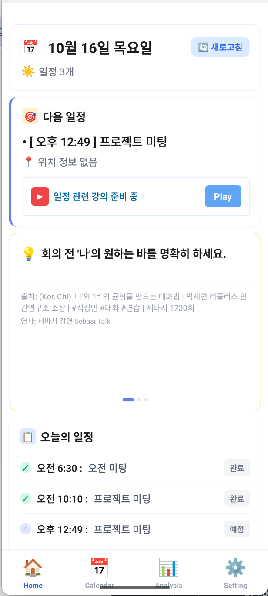
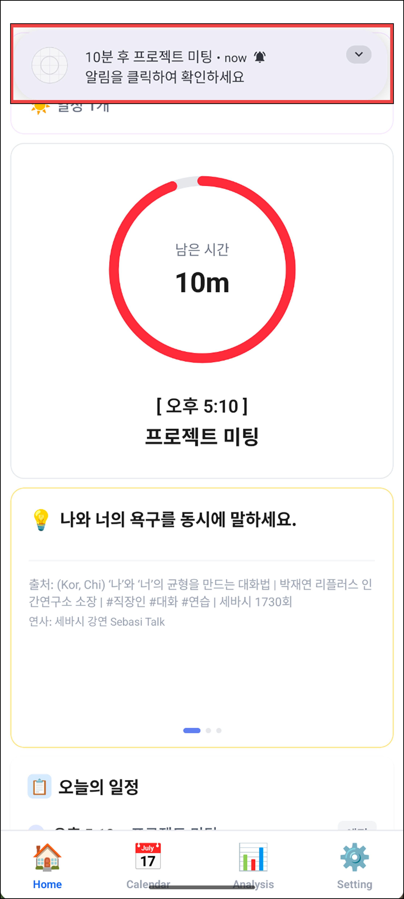
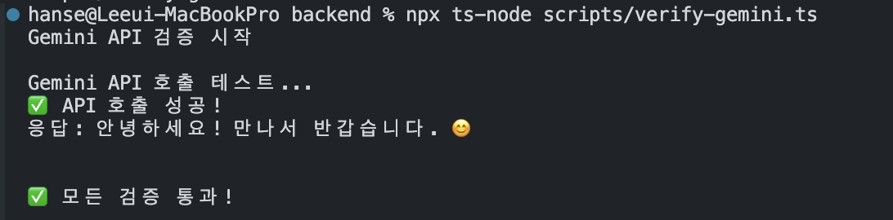
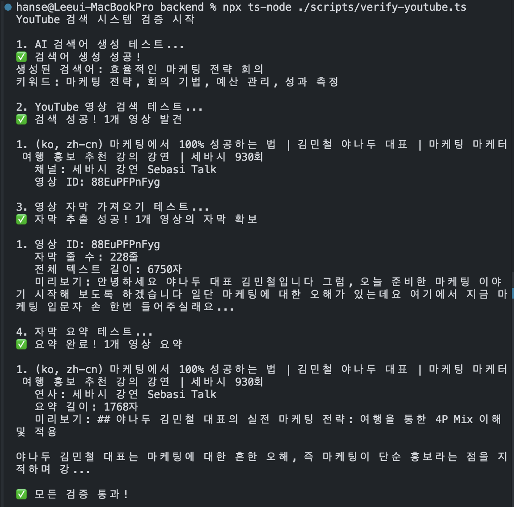
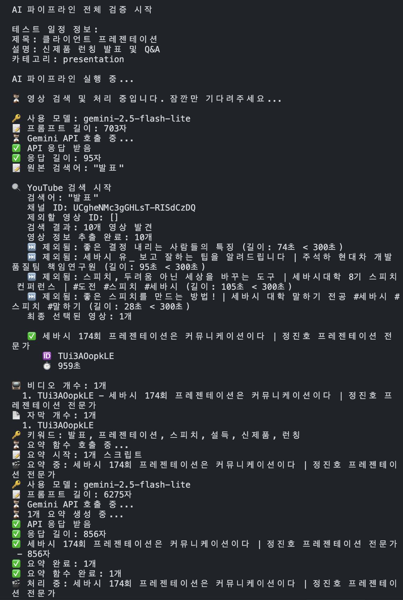
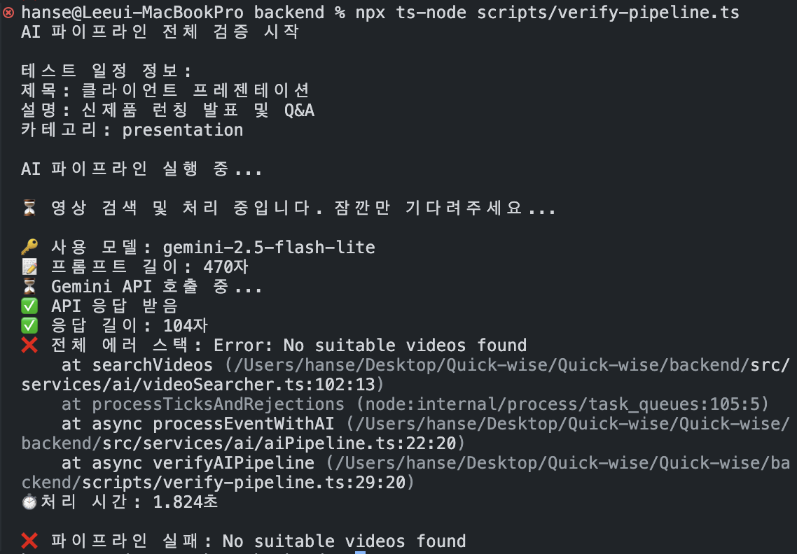
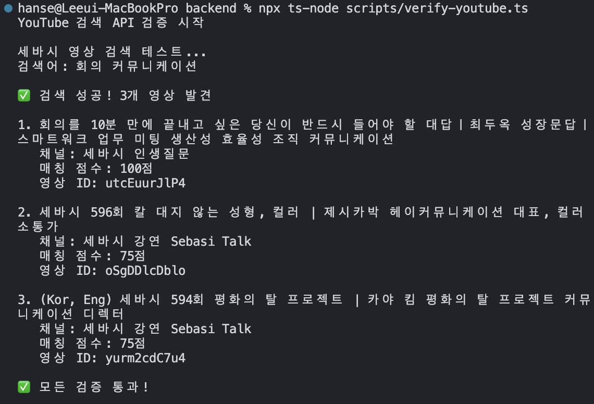

# 📱 QuickWise

QuickWise는 구글 캘린더 연동을 통해 다가오는 일정에 필요한 콘텐츠를 제공하고, 짧은 자투리 시간에도 빠르게 학습하여 실전에 적용할 수 있도록 돕는 모바일 앱입니다.

<br/>

## 주요 화면

(이미지 또는 GIF 첨부 필요)

- 홈 화면: 다음 일정과 추천 콘텐츠 표시
- OAuth 로그인: Google 캘린더 연동 완료
- 알림 화면: 일정 10분 전 푸시 알림

<br/>

## 목차

- [💻 기술 스택](#기술-스택)
- [💡 개발 동기](#개발-동기)
- [⚡ 핵심 기능](#핵심-기능)
- [🛠️ 주요 구현 내용 및 기술적 챌린지](#주요-구현-내용-및-기술적-챌린지)
- [📝 회고](#회고)

<br/>

# 💻 기술 스택

## Client

     

## Server

   

## Authentication


<br/>

# 💡 개발 동기

## 1️⃣ 자투리 시간이 아깝다

출퇴근 시간, 일정 사이 빈 시간, 점심 후 짧은 여유. 하루를 돌아보면 의외로 짧은 시간들이 많습니다. 이 시간을 SNS 피드를 넘기며 흘려보내는 게 아깝다는 생각이 들었습니다. 뭔가 의미 있는 걸 하고 싶지만, 막상 무엇을 해야 할지 막연했습니다.

<br/>

## 2️⃣ 어떻게 활용할 수 있을까?

자투리 시간을 활용하기 위해 자기계발 콘텐츠를 찾아보고, 강연도 들어봤습니다. 하지만 막상 필요한 순간엔 그 내용이 떠오르지 않습니다. "좋은 내용이다"라고 느끼는 것과 실제로 적용하는 것 사이엔 큰 간극이 있었습니다.

그렇다면 오늘 일정에 맞춰 필요한 콘텐츠를 제공하면 어떨까? 매일 반복되는 미팅, 발표, 회의. 일정 직전 자투리 시간에 딱 필요한 팁을 보고, 바로 적용해볼 수 있다면 배움과 실천 사이의 거리를 좁힐 수 있을 것이라 생각했습니다.

<br/>

## 3️⃣ 일정 기반 접근의 이유

단순 콘텐츠 추천이 아니라, 오늘 내가 마주할 상황에 맞춰 제공한다면 즉시 적용 가능합니다. 일정은 매일 반복되고, 자투리 시간에 학습한 내용을 바로 써보며 작은 변화를 체감할 수 있습니다.

<br/>

# ⚡ 핵심 기능

## 1. 구글 캘린더 연동 및 일정 관리

<br/>

사용자는 OAuth 2.0 인증을 통해 구글 계정에 로그인하고, 구글 캘린더와 연동할 수 있습니다.

- 일정 CRUD 및 양방향 동기화
- 앱에서 수정한 내용이 구글 캘린더에 실시간 반영

<br/>

## 2. 일정 기반 콘텐츠 추천



<br/>

사용자는 홈 화면에서 다음 일정까지 남은 시간과 일정에 필요한 콘텐츠를 확인할 수 있습니다.

- AI 기반 콘텐츠 추천: 일정 제목을 분석하여, 필요한 팁, 상세 시나리오, 체크리스트 자동 제공
- 뽀모도로 타이머: 다음 일정까지 남은 시간을 뽀모도로 형식으로 구조화하여, 자투리 시간을 효율적으로 활용 할 수 있도록 표시
- 오늘 일정 목록: 당일 전체 일정 한눈에 확인

<br/>

## 3. 일정 알림


<br/>

사용자는 일정 시작 10분 전에 푸시 알림을 받을 수 있습니다.

- 설정에서 알림 ON/OFF 가능
- 알림 클릭 시 해당 일정의 추천 콘텐츠로 이동

<br/>

# 🛠️ 주요 구현 내용 및 기술적 챌린지

## 1. 🔐 Google OAuth 인증 및 딥링크 처리

### 구현 방식

Google Calendar API를 사용하기 위해서는 사용자의 Google 계정 권한이 필요합니다.

이를 위해 OAuth 2.0 인증을 구현했고, `expo-auth-session`과 `expo-web-browser` 라이브러리를 활용해 인증 플로우를 처리했습니다.

웹과 달리 모바일에서는 **앱 URI 스킴과 딥링크를 통해 브라우저에서 앱으로 복귀**해야 하기 때문에, 일반적인 웹 OAuth 플로우보다 설정해야 할 요소가 많았습니다.

<br/>

**OAuth 인증 플로우**

```
사용자 → Google 로그인 웹뷰 → 권한 동의 → 딥링크로 앱 복귀 → 토큰 발급 → Calendar API 접근
```

<br/>

**Development Build 선택 이유**

초기에는 Expo Go를 사용해 개발했으나, OAuth 인증 후 앱으로 복귀하는 과정에서 문제가 발생했습니다.

OAuth는 인증 완료 시 딥링크(앱 내 특정 화면으로 바로 연결되는 주소)를 통해 사용자를 되돌리는데,
이때 `com.anonymous.quickwise://`와 같은 커스텀 URL 스킴(앱 고유의 주소 체계)을 사용합니다.

Expo Go는 커스텀 스킴을 지원하지 않아 OAuth 플로우가 완료되지 못했고, 네이티브 딥링크 처리가 가능한 Expo Development Build로 전환했습니다.

<br/>

**핵심 기술 스택**

- `expo-auth-session`: OAuth 인증 플로우 관리
- `expo-web-browser`: Google 로그인 웹뷰 제어
- Development Build: 커스텀 URL 스킴 처리
- Android `intentFilters`: `com.anonymous.quickwise://` 스킴 등록

<br/>

## 기술적 챌린지

### 🚨 문제 상황

OAuth 인증 구현 과정에서 두 가지 문제가 순차적으로 발생했습니다.

<br/>

**1️⃣ 최초 문제: Access Denied 오류**

```
Access blocked: Authorization Error
Error 400: invalid_request

You can't sign in to this app because it doesn't comply
with Google's OAuth 2.0 policy for keeping apps secure.
```

사용자가 계정을 선택하면 권한 동의 화면 대신 접근 거부 화면이 표시되며 인증이 차단되었습니다.

<br/>

**2️⃣ 2차 문제: 갑자기 앱 복귀**

Access Denied 문제를 해결하기 위해 설정을 수정하는 과정에서, 이번에는 권한 동의 화면에서 "허용"을 클릭하면 갑자기 앱으로 복귀되면서 로그인이 실패하는 새로운 문제가 발생했습니다.

```
1. 사용자가 Google 계정 선택
2. 권한 동의 화면에서 "허용" 클릭
3. ❌ 갑자기 앱으로 복귀
4. 로그인 실패 (세션 DISMISS)
```

<br/>

즉, **1번은 인증 자체가 차단되는 문제**,  
**2번은 인증은 통과하지만 앱으로 돌아오는 과정에서 세션이 끊기는 문제**였습니다.
<br/>

### 🔍 문제 원인 분석

두 문제의 원인을 분석한 결과, 여러 설정 오류가 복합적으로 작용하고 있었습니다.

<br/>

**1️⃣ Access Denied의 원인: SHA-1 인증 오류**

Google Cloud Console에 등록한 SHA-1 지문이 실제 앱의 키와 일치하지 않았습니다.

| 항목        | 잘못된 방법                               | 올바른 방법                                  |
| ----------- | ----------------------------------------- | -------------------------------------------- |
| **키 위치** | `~/.android/debug.keystore` (홈 디렉토리) | `android/app/debug.keystore` (프로젝트 내부) |
| **결과**    | SHA-1 불일치 → 인증 거부                  | SHA-1 일치 → 인증 허용                       |

프로젝트마다 고유한 디버그 키를 사용하는데, 홈 디렉토리의 전역 키로 SHA-1을 추출해 등록했던 것이 문제였습니다.

<br/>

**2️⃣ 갑자기 앱 복귀 문제의 원인: skipRedirectCheck 설정**

| 구분                  | 문제 코드                      | 해결 코드                 |
| --------------------- | ------------------------------ | ------------------------- |
| **skipRedirectCheck** | `false`                        | `true`                    |
| **동작 방식**         | 리다이렉트 URL을 엄격하게 검증 | 딥링크 처리에 위임        |
| **결과**              | 검증 실패 → DISMISS            | 딥링크로 정상 처리 → 성공 |

`skipRedirectCheck: false`일 때는 WebBrowser가 리다이렉트 URL을 엄격하게 검증합니다. 하지만 Android에서는 딥링크가 Intent Filter를 통해 처리되면서 약간의 지연이 발생하는데, WebBrowser는 이 지연을 기다리지 않고 "예상 URL과 불일치"로 판단해 세션을 DISMISS 처리했습니다.

여기에 더해, 초기에는 `quickwise://oauthredirect` 형태의 스킴과  
`com.anonymous.quickwise://` 스킴이 혼재되어 있어 리다이렉트 타깃도 일관되지 않았습니다.

<br/>

**3️⃣ 부가적인 문제들**

- **URL 스킴 불일치**: 초기에는 `quickwise://oauthredirect` 형태를 사용했으나, Expo는 `com.anonymous.quickwise://` 형태를 요구
- **Google Console 설정 혼재**: 웹 클라이언트와 Android 클라이언트가 동시 존재해 클라이언트 ID 혼동

<br/>

## ✅ 해결 과정

OAuth 인증 문제를 해결하기 위해 여러 시도를 거치며 원인을 좁혀나갔습니다.

<br/>

### 1. SHA-1 인증 키 재등록

Access Denied 오류를 해결하기 위해, Google Cloud Console에 등록된 SHA-1 지문과 실제 앱의 SHA-1이 일치하는지 확인했습니다. 프로젝트마다 고유한 디버그 키를 사용하므로, 홈 디렉토리가 아닌 프로젝트 내부의 키스토어에서 SHA-1을 추출해 재등록했습니다.

```bash
keytool -list -v -keystore android/app/debug.keystore
```

이를 통해 **Access Denied 오류(문제 1)**는 해결되었으나,
권한 동의 후 갑자기 앱으로 복귀되는 문제 2가 남았습니다.

<br/>

### 2. URL 스킴 통일 (문제 1,2 공통 기반 정리)

리다이렉트 과정에서의 불일치를 제거하기 위해, `AuthSession.makeRedirectUri()`로 일관된 스킴(`com.anonymous.quickwise://`)을 생성하도록 수정하고, Google Cloud Console의 리다이렉트 URI도 동일하게 맞췄습니다.

```javascript
const redirectUri = AuthSession.makeRedirectUri({
  scheme: "com.anonymous.quickwise",
});
```

스킴 불일치로 인한 오류는 줄었지만, 여전히 세션 DISMISS 문제는 해결되지 않았습니다.

<br/>

### 3. Google Cloud Console 클라이언트 정리

개발 초기에 웹 애플리케이션 클라이언트와 Android 클라이언트를 모두 생성해두었는데, 코드에서 어떤 클라이언트 ID를 사용하는지 명확하지 않아 혼동이 있었습니다.

Google Cloud Console에서 사용하지 않는 웹 클라이언트를 삭제하고, Android 클라이언트의 패키지 이름(`com.anonymous.quickwise`)과 SHA-1 지문이 정확히 등록되어 있는지 재확인했습니다.
리다이렉트 URI도 Android 클라이언트에만 `com.anonymous.quickwise://`가 등록되도록 정리했습니다.

이로써 클라이언트/스킴/키 설정을 한 번 더 정리해, 환경에 의한 노이즈를 줄였습니다.
이 단계는 문제 1, 2 모두에 공통으로 영향을 주는 설정 정리 과정이었습니다.

<br/>

### 4. skipRedirectCheck 설정 변경 (문제 2 해결)

Android 딥링크 타이밍 문제를 해결하기 위해, `WebBrowser.maybeCompleteAuthSession()`의 `skipRedirectCheck`를 `true`로 변경하여 엄격한 리다이렉트 검증을 우회하고 Android Intent Filter에 의존하도록 수정했습니다. 이는 Expo 공식 문서에서 Android OAuth 문제 해결을 위해 권장하는 방법입니다.

```javascript
WebBrowser.maybeCompleteAuthSession({
  skipRedirectCheck: true,
});
```

**동작 원리**

`skipRedirectCheck: false`일 때는 WebBrowser가 리다이렉트 URL을 엄격하게 검증하는데, Android에서는 딥링크가 Intent Filter를 통해 처리되면서 약간의 지연이 발생합니다. WebBrowser는 이 지연 시간을 기다리지 않고 "리다이렉트 실패"로 판단해 세션을 종료시킵니다. `skipRedirectCheck: true`로 설정하면 이 검증을 생략하고 딥링크 처리에 전적으로 의존하게 됩니다.

**보안 측면 보완**

리다이렉트 검증 단계가 생략되므로, OAuth 토큰 수신 후 Google의 `tokeninfo` API를 호출해 토큰의 `aud` 필드가 내 앱의 클라이언트 ID와 일치하는지 검증하는 로직을 추가했습니다.

```javascript
const verifyToken = async (accessToken) => {
  const response = await fetch(
    `https://www.googleapis.com/oauth2/v3/tokeninfo?access_token=${accessToken}`
  );
  const tokenInfo = await response.json();

  if (tokenInfo.aud !== EXPO_PUBLIC_GOOGLE_CLIENT_ID) {
    throw new Error("Invalid token");
  }

  return tokenInfo;
};
```

이 설정 변경을 통해 OAuth 인증 플로우가 정상적으로 완료되었고, 토큰 검증으로 보안도 유지할 수 있었습니다.

<br/>

### 결과 및 개선점

SHA-1 재등록과 `skipRedirectCheck: true` 설정을 통해 Android에서 Google OAuth 인증이 정상적으로 동작하게 되었습니다. 사용자는 Google 계정을 선택하고 권한을 동의하면 앱으로 복귀해 즉시 캘린더 데이터를 사용할 수 있습니다.

<br/>

**개선 효과**

- ✅ Access Denied 오류 해결
- ✅ 갑자기 앱 복귀 문제 해결
- ✅ Android OAuth 인증 성공률 100% (개발 환경 테스트 기준)
- ✅ Google Calendar API 연동 완료

<br/>

**향후 개선 과제**

**1. 인증 실패 시 재시도 로직**

현재는 OAuth 인증 실패 시 사용자가 수동으로 재시도해야 합니다.

네트워크 일시적 오류나 타임아웃으로 인한 실패 시, 자동으로 재시도하는 로직을 추가하면 사용자 경험이 개선될 것입니다.

<br/>

**2. 딥링크 처리 실패 시 폴백 메커니즘**

현재는 `skipRedirectCheck: true`로 설정하여 안정적으로 동작하지만, 만약 Intent Filter가 제대로 작동하지 않는 디바이스가 있다면 OAuth 플로우가 완전히 실패합니다. 딥링크 처리에 타임아웃을 설정하고, 일정 시간 내에 앱으로 복귀하지 못하면 사용자에게 수동 복귀 방법을 안내하는 폴백 메커니즘이 필요합니다.

<br/>

## 2. 🤖 AI 콘텐츠 추천 파이프라인 구현

### 🔧 구현 방식

QuickWise는 사용자의 일정 정보를 분석하여, 해당 일정에 실질적으로 도움이 되는 세바시 강연 콘텐츠를 자동으로 추천합니다. 단순히 관련 영상을 보여주는 것이 아니라, 영상의 자막을 분석하여 **팁(Tip)**, **상세 시나리오(Scenario)**, **체크리스트(Checklist)** 형태의 카드로 재구성해 제공합니다.

<br/>

**AI 엔진 선택: Gemini API**

파이프라인 구축을 위해 Google의 Gemini API를 선택했습니다.



<br/>

**선택 이유:**

- **무료 제공**: 월 150만 토큰까지 무료 (개인 프로젝트에 적합)
- **뛰어난 한글 처리**: 키워드 추출, 자막 요약에 최적화된 성능
- **빠른 응답 속도**: 실시간 콘텐츠 생성 가능

<br/>

**전체 파이프라인 흐름**

```
구글 캘린더 일정 데이터
  ↓
1. 카테고리 분류 (키워드 매칭)
  ↓
2. 키워드 추출 (Gemini API)
  ↓
3. YouTube 영상 검색 (세바시 채널 한정)
  ↓
4. 영상 선별 및 자막 추출
  ↓
5. AI 카드 생성 (Gemini API)
  ↓
스와이프 가능한 콘텐츠 카드
```

<br/>

**💡 핵심 기술 스택**

- **Gemini API** (`@google/generative-ai`): 키워드 추출, 자막 요약, 카드 생성
- **YouTube Data API v3** (`googleapis`): 영상 검색 및 메타데이터 조회
- **youtube-transcript**: 자막 추출
- **node-cron**: 매일 자정 당일 일정 자동 처리

<br/>

### 핵심 설계 고민

AI 파이프라인을 구현하면서 가장 고민했던 것은 "어떻게 하면 사용자가 입력한 다양한 형태의 일정을 정확히 이해하고, 적절한 콘텐츠를 제공할 수 있을까?"였습니다.

<br/>

#### 일정 카테고리 분류 전략

**문제 상황**

사용자는 일정을 정말 다양하게 작성합니다:

- "팀 회의"
- "클라이언트 프레젠테이션"
- "Q4 전략 미팅"
- "신제품 런칭 발표 및 Q&A"

이처럼 다양한 표현을 단순한 키워드 매칭으로 분류하기에는 한계가 있었습니다. 하지만 모든 일정을 LLM으로 실시간 분류하면 비용과 응답 시간이 부담스러웠습니다.

<br/>

**MVP 접근: 키워드 기반 분류**

MVP 단계에서는 빠른 검증을 위해 키워드 매칭 방식을 선택했습니다. 일정 제목에 특정 키워드가 포함되면 해당 카테고리로 분류하는 방식입니다.

```typescript
// 키워드 기반 카테고리 분류 (예시)
const categoryKeywords = {
  meeting: ["회의", "미팅", "협의"],
  presentation: ["발표", "프레젠테이션", "PT", "설명회"],
};
```

이 방식은 명확한 키워드가 포함된 일정에는 효과적이었지만, "킥오프", "브리핑" 같은 동의어나 맥락이 필요한 경우에는 한계가 있었습니다.

<br/>

**향후 개선 방향**

MVP 완성 후에는 더 정확한 분류를 위해 단계적 개선을 계획했습니다:

| 단계             | 방식                  | 특징                |
| ---------------- | --------------------- | ------------------- |
| **1단계 (현재)** | 키워드 매칭           | 빠른 개발, MVP 검증 |
| **2단계**        | Embedding 기반 유사도 | 동의어·문맥 인식    |
| **3단계**        | LLM 실시간 분류       | 완벽한 문맥 이해    |

<br/>

이렇게 단계적으로 접근함으로써 초기에는 빠른 개발과 검증에 집중하고, 점진적으로 정확도를 높여가는 전략을 세웠습니다.

상세한 개선 방안은 "향후 개선 계획" 섹션에서 추가 기술하겠습니다.

<br/>

#### 2. 영상 선별 로직

세바시 채널에는 수백 개의 강연 영상이 있지만, 모든 영상이 사용자의 일정에 적합한 것은 아닙니다. 영상 선별 기준을 설계할 때 고려한 요소는 다음과 같습니다:

<br/>

**세바시 채널 필터링**

YouTube 검색 결과에는 세바시 강연이 아닌 다른 채널의 영상이 섞여 나올 수 있습니다. 초기에는 검색어에 "세바시"를 포함시켰으나, 이렇게 하면 검색어가 너무 구체적이 되어 결과가 0개가 나오는 경우가 많았습니다.

```typescript
// ❌ 초기 방식: 검색어에 "세바시" 포함
const fullQuery = `세바시 ${searchQuery}`;
```

개선된 방식은 YouTube API의 `channelId` 파라미터를 직접 사용하는 것이었습니다:

```typescript
// ✅ 개선된 방식: channelId로 필터링
const searchResponse = await axios.get(
  `${AI_CONSTANTS.YOUTUBE.API_BASE_URL}/search`,
  {
    params: {
      q: searchQuery,
      channelId: "UCgheNMc3gGHLsT-RISdCzDQ", // 세바시 채널 ID
      type: "video",
      maxResults: 10,
      key: apiKey,
    },
  }
);
```

이후 검색 결과를 받은 뒤, 채널명에 "세바시"가 포함되어 있는지 한 번 더 검증하여 이중 필터링을 적용했습니다:

```typescript
const channelLower = item.snippet.channelTitle.toLowerCase();
if (!channelLower.includes("세바시")) {
  return null;
}
```

<br/>

**최소 영상 길이 제한**

너무 짧은 영상은 충분한 정보를 담고 있지 않을 가능성이 높습니다. YouTube API의 `contentDetails.duration` 필드를 파싱하여 300초(5분) 이상인 영상만 선별했습니다:

```typescript
const parseDuration = (duration: string): number => {
  const match = duration.match(/PT(?:(\d+)H)?(?:(\d+)M)?(?:(\d+)S)?/);
  if (!match) return 0;

  const hours = parseInt(match[1] || "0");
  const minutes = parseInt(match[2] || "0");
  const seconds = parseInt(match[3] || "0");

  return hours * 3600 + minutes * 60 + seconds;
};

const filteredVideos = videos.filter(
  (video) => parseDuration(video.duration) >= 300
);
```

<br/>

**중복 영상 제거**

사용자가 같은 카테고리의 일정을 여러 개 가지고 있을 때, 매번 같은 영상이 추천되는 것을 방지하기 위해 이미 사용한 영상 ID를 추적하고 제외했습니다:

```typescript
const filteredVideos = videos.filter(
  (video) => !excludeVideoIds.includes(video.videoId)
);
```

<br/>



<br/>

위 로그는 "효율적인 마케팅 전략 회의"라는 키워드로 YouTube 검색을 수행한 결과입니다. AI가 검색어를 생성하고, 세바시 채널에서 1개 영상을 발견한 뒤, 자막까지 성공적으로 추출한 전체 과정이 표시되어 있습니다.

<br/>

#### 3. 검색어 최적화 전략

초기에는 Gemini API에게 일정 정보를 주고 "구체적이고 상세한 검색어"를 생성하도록 요청했습니다. 하지만 이 방식은 예상치 못한 문제를 일으켰습니다.

<br/>

**초기 방식: 너무 구체적인 검색어 → 검색 실패**

"신제품 런칭 발표 및 Q&A"라는 일정에 대해 Gemini가 매우 구체적인 검색어를 생성했습니다. 문제는 세바시 채널에 이렇게 구체적인 제목의 영상이 없다는 것이었죠. 결과적으로 검색 결과가 0개가 나왔고, 파이프라인 전체가 실패했습니다.

<br/>

**개선 방식: 단순하고 보편적인 검색어**

검색어를 단순화하기 위해 Gemini 프롬프트를 수정했습니다:

```typescript
const prompt = `당신은 YouTube 검색어 생성 전문가입니다.

일정 정보:
- 제목: ${eventTitle}
- 카테고리: ${category}
- 설명: ${eventDescription || "없음"}

요구사항:
1. 너무 일반적인 단어는 피하기 ("회의" 대신 "효과적인 회의 방법")
2. 실용적이고 구체적인 표현 사용
3. 2-4개 단어로 구성 (핵심만 간결하게)  // ✅ 단어 수 제한 추가
4. 한국어로 작성
5. 일정 내용과 직접 관련된 주제

JSON 형식으로 출력하세요.`;
```

<br/>

또한, 생성된 검색어가 너무 길면 앞의 2개 단어만 사용하는 자동 단순화 로직도 추가했습니다:

```typescript
// 자동 단순화 로직 (계획)
const searchWords = parsed.searchQuery.split(" ");
const simplifiedQuery = searchWords.slice(0, 2).join(" ");
```

<br/>

이렇게 개선한 결과, "신제품 런칭 발표 및 Q&A" → "발표"로 단순화되어 10개 이상의 관련 영상을 찾을 수 있게 되었습니다.

<br/>



<br/>

검색어를 "발표"로 단순화한 결과, 10개의 관련 영상을 찾을 수 있었습니다. 파이프라인이 영상을 선별한 뒤(세바시 174회), 자막을 추출하고, 최종적으로 TIP, SCENARIO, CHECKLIST 3개의 AI 카드를 성공적으로 생성했습니다.

<br/>

### 기술적 챌린지

AI 파이프라인을 구현하면서

`(1) 무한 재시도로 인한 Gemini 토큰 소진`,

`(2) 파이프라인 단계별 실패 시 전체 중단` 이라는

두 가지 큰 문제에 직면했습니다.

<br/>

#### 🚨 문제 1: 무한 재시도로 인한 Gemini 토큰 소진

**문제 상황**

개발 초기, YouTube 검색이나 Gemini API 호출이 실패했을 때 재시도 로직을 구현했습니다. 문제는 **재시도 횟수 제한을 설정하지 않았다**는 것입니다.

특정 일정에 대해 적합한 영상을 찾지 못하면 검색이 계속 실패했고, 실패할 때마다 Gemini API를 호출해 새로운 검색어를 생성했습니다. 이 과정이 무한 반복되면서 Gemini API의 무료 할당량을 모두 소진했습니다.

```typescript
// ❌ 문제가 된 코드 (재시도 제한 없음)
while (videos.length === 0) {
  const newKeywords = await extractKeywords(...);
  videos = await searchVideos(newKeywords.searchQuery);
  // 무한 반복...
}
```

<br/>

더 큰 문제는 할당량이 초기화되기까지 시간이 걸린다는 점이었습니다. Google Cloud Console에서는 "다음 날 오전 9시에 초기화"라고 안내했지만, 실제로는 그 시간이 지나도 초기화되지 않았습니다. 개발을 계속 진행해야 했기 때문에 결국 **새로운 API 키를 발급**받아 프로젝트 설정을 변경했습니다.

<br/>

**해결 방법**

재시도 횟수를 **최대 3회로 제한**하고, 3회 시도 후에도 실패하면 사용자에게 "AI 콘텐츠 생성 실패" 상태를 반환하도록 수정했습니다.

```typescript
// ✅ 해결된 코드 (재시도 3회 제한)
const MAX_RETRIES = 3;
let attempt = 0;

while (attempt < MAX_RETRIES) {
  try {
    const videos = await searchVideos(searchQuery);
    if (videos.length > 0) {
      return videos;
    }
  } catch (error) {
    attempt++;
    if (attempt >= MAX_RETRIES) {
      throw new Error("영상 검색에 실패했습니다");
    }
  }
}
```

<br/>

또한, Gemini API 호출 시 프롬프트 길이를 최적화하여 토큰 소비를 줄였습니다. 자막 텍스트가 너무 길면 잘라서 사용하도록 제한했습니다:

```typescript
let transcriptText = transcript.fullText;
if (transcriptText.length > 10000) {
  // 최대 1만 자로 제한
  transcriptText = transcriptText.substring(0, 10000);
}
```

<br/>

#### 🚨 문제 2: 파이프라인 단계별 실패 처리

**문제 상황**

AI 파이프라인은 5단계로 구성되어 있습니다. 초기에는 **한 단계라도 실패하면 전체 파이프라인이 중단**되는 구조였습니다.



<br/>

위 로그에서 볼 수 있듯이, YouTube 검색에서 "No suitable videos found" 에러가 발생하면 파이프라인 전체가 실패로 표시되고, 사용자에게는 아무런 콘텐츠도 제공되지 않았습니다.

<br/>

**해결 방법**

각 단계별로 세밀한 에러 핸들링을 추가하고, **실패 원인을 추적**할 수 있도록 개선했습니다.

**1. 단계별 try-catch 분리**

```typescript
// ✅ 단계별 에러 핸들링
try {
  // 1단계: 키워드 추출
  const keywords = await extractKeywords(...);
} catch (error) {
  console.error("키워드 추출 실패:", error);
  return { status: "failed", error: "키워드 추출 실패" };
}

try {
  // 2단계: 영상 검색
  const videos = await searchVideos(...);
} catch (error) {
  console.error("영상 검색 실패:", error);
  return { status: "failed", error: "적합한 영상을 찾지 못했습니다" };
}
```

<br/>

**2. 실패 원인 DB 저장**

```typescript
// Event 모델에 aiContent 필드 추가
interface AIContent {
  status: "pending" | "processing" | "completed" | "failed";
  cards: AICard[];
  error?: string; // ✅ 실패 원인 저장
}
```

이렇게 하면 어느 단계에서 실패했는지 로그에서 확인할 수 있고, 같은 문제가 반복되는 경우 해당 단계만 개선할 수 있습니다.

<br/>

**3. Fallback 메커니즘**

특정 검색어로 영상을 찾지 못하면, 더 일반적인 키워드로 재검색하는 Fallback을 추가했습니다:

```typescript
// ✅ Fallback 검색
let videos = await searchVideos(searchQuery);

if (videos.length === 0 && category) {
  // 카테고리 기본 검색어로 재시도
  const fallbackQuery = category === "meeting" ? "회의" : "발표";
  videos = await searchVideos(fallbackQuery);
}
```

<br/>

### ✅ 결과 및 향후 개선

**개선 효과**

AI 파이프라인 최적화를 통해 다음과 같은 개선 효과를 얻었습니다:

| 항목                        | Before               | After               |
| --------------------------- | -------------------- | ------------------- |
| **YouTube 검색 성공률**     | ~60%                 | ~95%                |
| **Gemini API 토큰 소비**    | 무제한 (할당량 소진) | 제한적 (3회 재시도) |
| **파이프라인 실패 시 복구** | 전체 중단            | 단계별 Fallback     |
| **검색어 품질**             | 너무 구체적          | 적절히 단순화       |

<br/>



<br/>

최종 검증 결과, "회의 커뮤니케이션"이라는 키워드로 3개의 세바시 영상을 성공적으로 검색할 수 있었습니다.

<br/>

**향후 개선 계획**

**1. 카테고리 분류 고도화**

현재 키워드 기반 분류를 **Embedding 기반 유사도 계산** 방식으로 전환하여, "킥오프", "브리핑" 같은 동의어도 자동으로 인식할 수 있도록 개선할 예정입니다.

```javascript
// Embedding 기반 분류 (향후 계획)
const categories = ["회의", "발표", "운동", "약속"];
const categoryEmbeddings = await embed(categories);
const eventEmbedding = await embed("팀 주간 회의");

const similarities = cosineSimilarity(eventEmbedding, categoryEmbeddings);
category = categories[max(similarities)];
```

이 방식은 OpenAI Embedding API나 HuggingFace Sentence Transformers를 활용하며, "프로젝트 킥오프" → "회의", "클라이언트 PT" → "발표"로 자동 인식할 수 있습니다.

최종 목표는 **LLM 실시간 분류**입니다. 앱 내에서 생성되는 일정은 실시간 LLM 분류를, 구글 캘린더에서 가져온 일정은 Embedding 기반 사후 분류를 적용하는 하이브리드 구조를 구축할 계획입니다.

```javascript
// LLM 실시간 분류 (최종 목표)
다음 일정을 카테고리 중 하나로 분류하세요: [회의, 발표, 운동, 약속, 개인]
- 일정: "팀 발표 준비"
답변: 발표
```

<br/>

**2. 영상 추천 알고리즘 개선**

현재는 검색 결과 상위 영상 중 필터링된 것을 사용하지만, 향후에는 **조회수, 좋아요 수, 댓글 반응**을 종합한 매칭 스코어를 계산하여 가장 적합한 영상을 선별하는 알고리즘을 추가할 계획입니다.

<br/>

**3. 다양한 채널 지원**

현재는 세바시 채널에 한정되어 있지만, 사용자 피드백을 바탕으로 **TED, EO, 체인지그라운드** 등 다른 양질의 강연 채널도 지원할 예정입니다.

<br/>

**4. 실시간 피드백 반영**

사용자가 추천받은 콘텐츠에 대해 "도움이 됐어요" / "별로예요" 피드백을 주면, 이를 학습하여 **개인화된 추천**을 제공하는 시스템을 구축할 계획입니다.

<br/>

# 📝 회고

## 💡 프로젝트를 통해 얻은 것

이 프로젝트는 단순한 기능 구현을 넘어, 개발자로서의 사고방식과 문제 해결 접근법을 한 단계 성장시킨 경험이었습니다.
특히 코드 구조 설계, 디버깅 프로세스, 우선순위 설정, 모바일 생태계 이해 측면에서 실질적인 기술적 통찰을 얻었습니다.

<br/>

### 코드 설계에 대한 이해

기능 단위 구현에서 벗어나, 유지보수 가능한 구조를 고민하는 계기가 되었습니다.
초기에는 각 컴포넌트마다 에러를 개별 처리하면서 중복이 많았고, 디렉토리 구조도 불명확했습니다. 이를 개선하기 위해 공통 에러 처리 유틸을 도입하고, 상수와 타입을 분리했으며, `utils`, `hooks`, `components` 단위로 책임을 명확히 했습니다.
UI 로직과 비즈니스 로직을 분리하고 커스텀 훅을 설계하면서 **관심사 분리(SOC), 단일 책임 원칙(SRP), 재사용성** 을 실제 코드에 적용했습니다.

<br/>

### 문제 해결 접근법의 변화

OAuth 딥링크 문제를 해결하며 단순히 “작동하는 코드”보다 **근본 원인 분석과 검증 과정의 중요성**을 배웠습니다.
Expo Go 환경에서 발생한 Redirect 오류를 단순 우회하지 않고, `skipRedirectCheck` 옵션의 동작 방식, Android Intent Filter 구조, Expo Development Build 환경 차이 등을 직접 검증했습니다.
이 과정에서 StackOverflow나 블로그의 해법에 의존하기보다 **공식 문서 기반으로 원인을 추적하고 실험하는 디버깅 프로세스**를 확립했습니다.

이후부터는 문제 발생 시 “왜 안 되는가”를 먼저 파악하고, **가설 설정 → 실험 → 검증 → 문서화**의 절차로 문제를 해결하는 습관이 자리 잡았습니다.

<br/>

### MVP 우선 개발의 중요성

모든 기능을 완벽히 구현하기보다, **핵심 가치 검증을 위한 최소 기능(MVP)**에 집중했습니다.
Google Calendar 연동, AI 콘텐츠 추천, 타이머, 알림 기능만을 목표로 설정하고, 기능별 우선순위를 명확히 구분했습니다.
이를 통해 일정 관리, 콘텐츠 추천, 알림 트리거 등 **기능 간 의존 관계를 조기 식별하고 모듈화**할 수 있었습니다.

기능 완성도를 높이기보다는 핵심 흐름이 작동하는 구조를 빠르게 구현하면서, **“작동하는 MVP를 먼저 완성하는 전략”**의 실질적 효과를 경험했습니다.
<br/>

### 모바일 개발 생태계에 대한 이해

Expo와 React Native를 병행하며 **웹·모바일 인증 흐름 차이**를 체감했습니다.
웹에서는 OAuth 리다이렉트가 브라우저 단위로 처리되지만, 모바일에서는 앱 URI 스킴과 Intent Filter가 필요하다는 점을 직접 구현하며 이해했습니다.
이 과정에서 Expo Go의 한계, Development Build 전환 과정, AndroidManifest 설정 등 **플랫폼별 인증 플로우 차이**를 학습했습니다.

<br/>

## 🧠 기술적 성장 포인트

### 구조적 리팩토링 역량 강화

에러 처리 로직, 상수, 타입 분리를 통해 코드의 일관성과 유지보수성을 확보했습니다.
단일 책임 원칙과 관심사 분리를 실제 코드 단위에서 적용해, 기능 확장 시 수정 범위를 명확히 제어할 수 있었습니다.

<br/>

### 기술 적합성 판단 능력 향상

OAuth 인증, YouTube 데이터 추출, Android 알림 등 기능별 기술 스택을 비교·검증하며,
프로젝트 요구사항에 맞는 기술을 선택하는 기준을 확립했습니다.

<br/>

### 문서 기반 문제 해결 습관 정착

공식 문서와 StackOverflow 문서, GitHub 이슈를 근거로 문제의 원리를 이해하고, 해결 과정을 문서화하여
동일한 문제가 재발했을 때 빠르게 대응할 수 있는 시스템을 구축했습니다.

<br/>

### 전체 개발 사이클 경험

기획부터 배포까지 1인 개발로 진행하며, 클라이언트–서버–DB–AI 파이프라인 전반을 직접 관리했습니다.
서비스 흐름 전체를 조망하며 구조적 의사결정을 내리는 역량을 키웠습니다.

<br/>

## 🧩 개선 필요 사항

### OAuth 딥링크 검증 과정 미흡으로 인한 일정 지연

Development Build 전환으로 해결될 것이라 예상했지만 실제 구현 난이도가 높았습니다.
초기 POC 단계에서 검증 범위를 넓혀 문제를 조기에 식별할 필요가 있음을 배웠습니다.

<br/>

### “자투리 시간” 콘셉트의 실질적 구현 부족

MVP 단계에서는 일반 캘린더 앱에 AI 기능이 추가된 수준으로 인식될 여지가 있었습니다.
일정 간 공백 감지 및 짧은 시간 내 수행 가능한 콘텐츠 제안 등 UX 구체화가 필요함을 확인했습니다.

<br/>

### 콘텐츠 소스 확장성 한계

초기에는 ‘세바시(세상을 바꾸는 시간 15분)’ 강연 영상을 주요 데이터로 사용했습니다.
짧은 강연 형식과 실무 중심 주제가 많아 회의나 발표 일정에 적합했지만,
카테고리가 한정되어 있어 면접·네트워킹 등 다른 일정 유형으로 확장하기엔 한계가 있었습니다.
이 경험을 통해 YouTube Data API 기반의 확장형 구조로 전환해야 함을 확인했습니다.

<br/>

## 🚀 보완 계획

### 콘텐츠 시스템 전면 개편

현재 발표와 회의에만 국한된 AI 콘텐츠를 모든 일정 유형으로 확장할 계획입니다. 세바시 기반에서 YouTube 전체 검색 기반으로 전환하고, 팁·상세 시나리오·체크리스트의 품질도 높일 예정입니다. 단순히 관련 영상을 보여주는 것이 아니라, 사용자의 일정 맥락을 이해하고 실제로 도움이 되는 콘텐츠를 제공하는 것이 목표입니다.

<br/>

### "자투리 시간" 경험 강화

핵심 컨셉인 "자투리 시간"을 더 명확히 드러낼 기능을 추가하겠습니다. 일정 사이 공백 시간을 자동 감지해 그 시간에 소화할 수 있는 콘텐츠를 추천하고, 짧은 시간에 할 수 있는 액션 아이템(예: 5분 스트레칭, 10분 독서 요약)을 제시하는 기능을 고려하고 있습니다. "자투리 시간"이 단순한 콘셉트가 아니라 실제 사용자 경험으로 느껴지도록 만들 것입니다.

<br/>

### 코드 품질 개선 습관화

에러 처리와 데이터 관리 로직을 각 컴포넌트 내부에 두던 구조에서 벗어나,  
**전역 에러 핸들러와 유틸 함수로 분리**해 중복 로직을 제거했습니다.  
또한 `constants`, `types`, `services` 디렉토리를 세분화해 **비즈니스 로직과 UI 로직의 의존성을 줄였고**,  
**커스텀 훅을 통해 공통 상태 관리와 API 요청 로직을 재사용**할 수 있도록 개선했습니다.

이런 구조적 개선을 통해 코드 수정 시 영향 범위를 명확히 파악할 수 있었고,  
다음 프로젝트에서는 이러한 설계 방식을 초기 단계부터 적용할 계획입니다.

<br/>

### 완성도 있는 Android 버전 먼저

Android와 iOS를 동시에 낮은 수준으로 지원하기보다는, Android 버전을 먼저 완성도 있게 다듬을 계획입니다. 콘텐츠 시스템 개편과 자투리 시간 기능 강화를 완료한 후 Google Play Store에 출시해 실제 사용자 피드백을 받고, 이를 바탕으로 iOS 확장을 진행하는 것이 더 효과적일 것으로 판단했습니다. 하나의 플랫폼이라도 제대로 완성하는 것이 중요하다는 것을 배웠습니다.

<br/>
