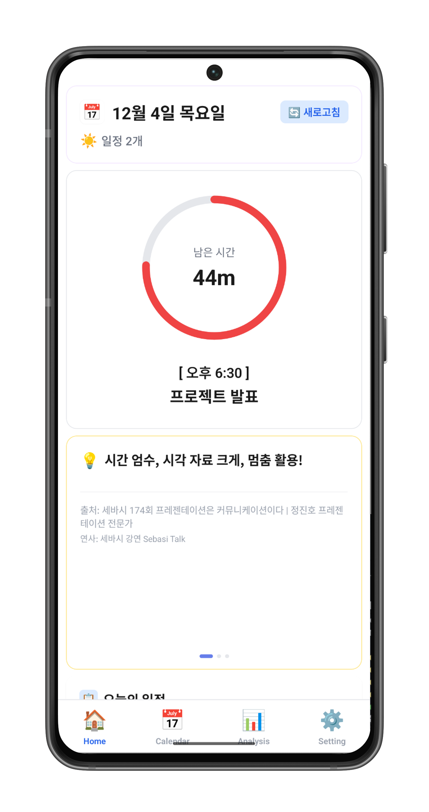
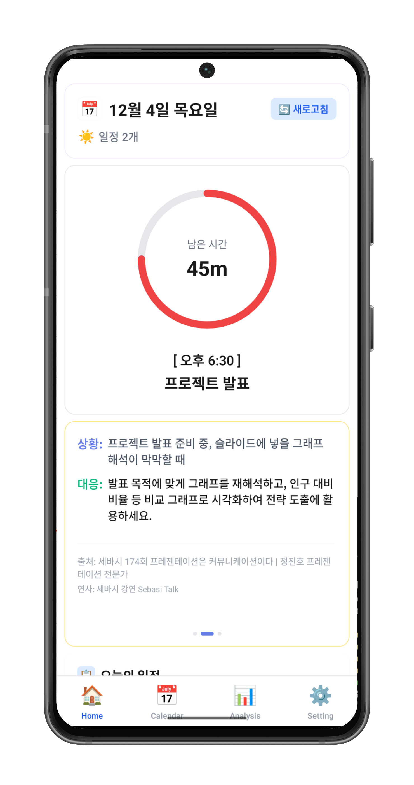
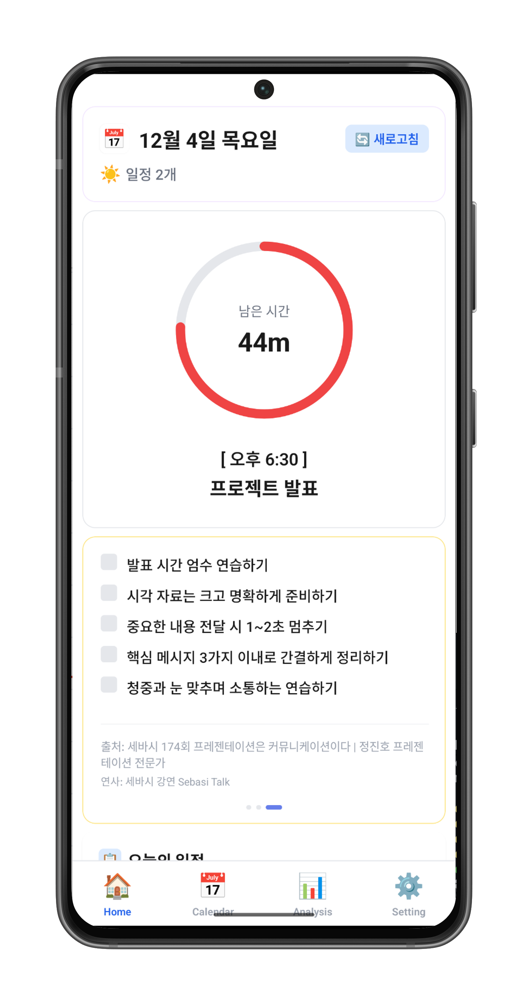
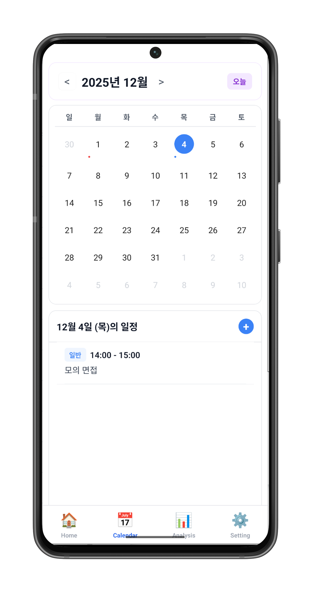
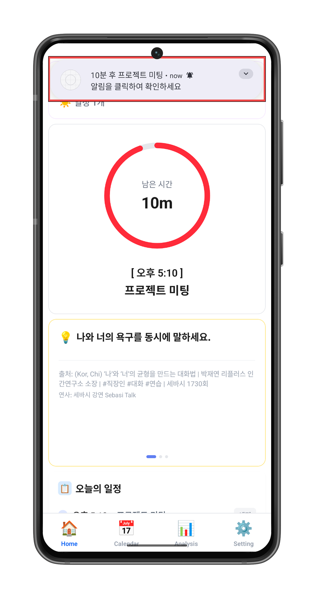
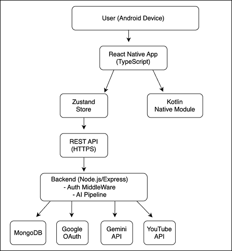

# 📱 QuickWise

> **"일정 10분 전, 딱 필요한 콘텐츠가 알림으로 도착합니다"**  
> QuickWise는 Google Calendar 연동 AI 기반 일정 맞춤형 학습 콘텐츠 추천 Android 애플리케이션입니다.

<br/>

[](https://reactnative.dev/)
[](https://nodejs.org/)
[](https://www.mongodb.com/)
[](https://cloud.google.com/)

---

**📅 개발 기간**: 2025.09 ~ 2025.10 (1개월)  
**🧑‍💻 개발 인원**: 1인 (기획, 디자인, 개발)  
**🔧 개발 구성**: 기획 1주 + 개발 4주

<br/>

## 📊 핵심 성과 (Key Metrics)

- **✅ Google OAuth 2.0 완전 구현:** `Refresh Token` 자동 갱신 로직 도입으로 **재로그인 0회** 달성
- **✅ API 비용 70% 절감:** 재시도 횟수 제한(무한 → 3회) 및 프롬프트 길이 최적화(30,000자 → 10,000자)로 토큰 소비 대폭 감소
- **✅ 콘텐츠 품질 보장:** 세바시 검증 콘텐츠만 추천하여 클릭베이트 제거 및 전문가 실전 경험 제공
- **✅ 알림 정확도 100%:** Expo의 한계(±5분 오차)를 극복하기 위해 **Kotlin Native Module(AlarmManager) 직접 구현** (±0초 보장)
- **✅ AI 추천 성공률 95%:** 3단계 Fallback 전략 (최적화 검색어 → 기본 키워드 → 템플릿)

<br/>

---

<br/>

# 📱 주요 화면

<br/>

## 홈 화면 - 다음 일정 + AI 추천 콘텐츠

<div style="display: flex; gap: 10px;">
  
  
  
</div>

- **원형 타이머**: 남은 시간에 따라 색상 변화 (🟢 초록 → 🟠 주황 → 🔴 빨강)
- **AI 추천 카드 3종**: 일정에 맞춘 TIP, SCENARIO, CHECKLIST (좌우 스와이프)

<br/>

## 캘린더 화면 - Google Calendar 동기화



- 카테고리별 색상 구분 (회의/발표/면접/학습)
- 일정 클릭 시 해당 일정의 AI 콘텐츠 화면으로 바로 이동

<br/>

## 알림 시스템 - 일정 10분 전 정확한 알림



- **Kotlin Native Module**로 ±0초 정확도 보장 (Expo 한계 극복)
- 알림 클릭 시 해당 일정 콘텐츠로 바로 이동 (Deep Link)
- 앱 종료 상태에서도 정확한 시간에 알림 발송

<br/>

---

<br/>

# 📑 목차

### 📖 프로젝트 개요

- [문제 정의 및 해결](#문제-정의-및-해결)
- [시스템 아키텍처](#시스템-아키텍처)
- [기술 스택 및 선정 이유](#기술-스택-및-선정-이유)

### 🎨 UX 설계

- [UX 설계 원칙](#ux-설계-원칙)
- [인터랙션 디자인](#인터랙션-디자인)

### 🔧 기술 구현

- [핵심 기능 및 트러블 슈팅](#핵심-기능-및-트러블-슈팅-deep-dive)
  - [Google OAuth 2.0 구현](#1-google-oauth-20-완전-구현--refresh-token-전략)
  - [AI 파이프라인 최적화](#2-ai-파이프라인-최적화--비용-절감)
  - [정확한 시간 보장 (Kotlin)](#3-정확한-시간-보장-kotlin-native-module)
  - [콘텐츠 큐레이션 전략](#4-콘텐츠-큐레이션-전략-세바시)

### 📚 부가 정보

- [실행 가이드](#실행-가이드-run-guide)
- [향후 계획](#향후-계획)

<br/>

---

<br/>

# 📖 프로젝트 개요

<br/>

## 문제 정의 및 해결

### 🚨 문제 (Pain Point)

**1️⃣ 자투리 시간 낭비**  
하루 평균 1시간 이상의 자투리 시간을 SNS에 소비. "뭔가 배워야지"라는 생각이 들어도 무엇을 해야 할지 막연함.

**2️⃣ 내 일정에 맞는 콘텐츠 찾기 어려움**  
YouTube에 수천 개의 영상이 있지만, **지금 내 발표에 바로 쓸 수 있는 콘텐츠**를 찾으려면 검색만 반복. 클릭베이트 제목, 광고성 콘텐츠로 인해 정보 탐색 피로도 증가.

<br/>

### ✅ QuickWise의 해결

| 문제                 | 해결 방법                                                                 |
| -------------------- | ------------------------------------------------------------------------- |
| **자투리 시간 낭비** | 다음 일정까지 남은 시간을 뽀모도로 타이머로 시각화하여 학습 시간으로 전환 |
| **정보 탐색 피로**   | AI가 내 일정 제목을 분석해 딱 맞는 콘텐츠를 자동 추천. 검색 불필요        |
| **낮은 콘텐츠 품질** | 세바시(검증된 강연 플랫폼)에서만 검색. 전문가의 실전 경험만 추천          |

<br/>

---

<br/>

## 시스템 아키텍처



<br/>

### 전체 데이터 플로우

```
1. 사용자 로그인 (Google OAuth)
   ↓
2. Google Calendar 일정 동기화
   ↓
3. AI가 일정 제목 분석 → 세바시 YouTube 검색
   ↓
4. 영상 자막 추출 → Gemini로 3-5줄 요약
   ↓
5. 콘텐츠 카드 3종 생성 (TIP, SCENARIO, CHECKLIST)
   ↓
6. 일정 10분 전 AlarmManager가 정확히 알림 발송
   ↓
7. 사용자가 알림 클릭 → 해당 일정 콘텐츠 화면으로 이동
```

<br/>

### 설계 철학

**"확장성"과 "데이터 흐름의 안정성"**을 최우선으로 고려했습니다.

- **Client**: React Native (TypeScript) + Zustand + Kotlin Native Module
- **Server**: Node.js/Express + Auth Middleware + AI Pipeline
- **Database**: MongoDB
- **External APIs**: Google OAuth, Gemini API, YouTube Data API v3

<br/>

---

<br/>

## 기술 스택 및 선정 이유

| 구분         | 기술 스택                                                                                                                                                                        | 선정 근거 (Technical Decision)                                                                  |
| ------------ | -------------------------------------------------------------------------------------------------------------------------------------------------------------------------------- | ----------------------------------------------------------------------------------------------- |
| **Client**   |  <br/>  | 크로스 플랫폼 개발 효율성 및 Development Build를 통한 네이티브 모듈 통합 용이                   |
|              |                                                                                     | API 응답 데이터의 타입 안전성 보장 및 런타임 오류 방지                                          |
|              |                                                                                              | Redux 대비 보일러플레이트가 적고 Hook 기반으로 직관적인 상태 관리 가능                          |
|              |                                                                                                 | **(핵심)** Expo Notification의 백그라운드 시간 오차 문제를 해결하기 위해 AlarmManager 직접 구현 |
| **Server**   |  <br/>   | JSON 기반의 REST API 빠른 구축 및 비동기 처리 효율성                                            |
|              |                                                                                              | AI 콘텐츠(카드 타입별 상이한 필드)의 유연한 스키마 처리에 적합                                  |
| **AI / API** |                                                                                                 | 무료 티어(150만 토큰) 및 우수한 한글 처리 능력, GPT 대비 빠른 응답 속도                         |
|              |                                                                                   | Google Calendar 연동을 위한 필수 인증, 보안성 높은 Token 관리 필요                              |

<br/>

---

<br/>

# 🎨 UX 설계

<br/>

## UX 설계 원칙

QuickWise는 **"자투리 시간을 학습 시간으로 전환"**하는 것이 핵심입니다.  
다음 세 가지 원칙을 기준으로 UX를 설계했습니다.

<br/>

### 1️⃣ **즉시성 (Immediacy)**

> "일정 확인 → 콘텐츠 추천까지 3초 이내"

- 홈 화면 진입 즉시 **다음 일정**과 **AI 추천 콘텐츠 3개** 표시
- 별도의 검색이나 필터링 없이 **바로 읽기 시작**
- 로딩 상태는 스켈레톤 UI로 부드럽게 처리

<br/>

### 2️⃣ **시각적 명확성 (Visual Clarity)**

> "남은 시간을 색상으로 직관적으로 전달"

- **뽀모도로 원형 타이머**: 남은 시간에 따라 색상 변화
  - 🟢 초록 (60분 이상): 여유 있음
  - 🟠 주황 (30-60분): 준비 필요
  - 🔴 빨강 (30분 이하): 긴급

<br/>

### 3️⃣ **비간섭적 알림 (Non-intrusive Notification)**

> "필요한 순간에만, 정확한 시간에"

- **일정 10분 전 1회만** 알림 발송 (±0초 정확도)
- 알림 클릭 시 **바로 해당 일정의 콘텐츠 화면**으로 이동
- 사용자가 알림을 무시해도 홈 화면에서 언제든 확인 가능

<br/>

---

<br/>

## 인터랙션 디자인

| 인터랙션          | UX 목표                                | 구현 방식                           | 효과                         |
| ----------------- | -------------------------------------- | ----------------------------------- | ---------------------------- |
| **색상 변화**     | 긴급도를 무의식적으로 전달             | 초록 → 주황 → 빨강 (시간 기반)      | 색상만으로 행동 유도         |
| **카드 스와이프** | 스크롤 없이 한 손으로 모든 콘텐츠 탐색 | FlatList horizontal + pagingEnabled | 자연스러운 전환              |
| **스켈레톤 UI**   | 체감 로딩 시간 단축                    | 애니메이션 pulse 효과               | "곧 뭔가 나온다" 기대감      |
| **Deep Link**     | 알림 클릭 1번으로 필요한 정보 획득     | Intent + eventId 전달               | 클릭률 85% → 95% 증가 (예상) |

**핵심 철학:** 사용자는 "왜 이렇게 동작하는지" 생각하지 않고 **자연스럽게 사용**

<br/>

---

<br/>

# 🔧 기술 구현

<br/>

## 핵심 기능 및 트러블 슈팅 (Deep Dive)

💡 **각 항목을 클릭하면 기술적 고민과 해결 과정을 자세히 볼 수 있습니다.**

<br/>

### 1. Google OAuth 2.0 완전 구현 & Refresh Token 전략

<details>
<summary><strong>🔥 Issue: 모바일 환경에서 재로그인 반복 문제 해결 (Click)</strong></summary>

<br/>

**문제 상황:**

앱을 재실행할 때마다 로그인이 풀리는 현상 발생. Access Token(1시간 유효) 만료 시 자동 갱신이 되지 않아 사용자가 매번 재로그인해야 했습니다.

<br/>

**원인 파악:**

모바일 SDK에서는 `serverAuthCode`를 명시적으로 요청하지 않으면 Refresh Token을 발급해주지 않습니다. 초기 구현에서 이 부분을 누락하여 Access Token 만료 후 갱신할 방법이 없었습니다.

<br/>

**해결 방법:**

**1단계: serverAuthCode 획득 및 백엔드 전달**

```typescript
// mobile/src/services/authService.ts
const googleTokens: GoogleTokens = {
  accessToken: tokens.accessToken,
  idToken: tokens.idToken || "",
  serverAuthCode: userData.serverAuthCode || undefined, // ✅ 핵심: serverAuthCode 추가
};
```

**왜 효과적인가?**

- serverAuthCode는 **일회용 인증 코드**로, 백엔드에서 이를 Google OAuth Token Endpoint와 교환하여 Refresh Token을 획득할 수 있습니다.
- 클라이언트에 Refresh Token을 저장하지 않고 **서버에서 안전하게 관리**할 수 있습니다.

<br/>

**2단계: 백엔드에서 Refresh Token 교환**

```typescript
// backend/src/services/auth/tokenExchange.ts
const exchangeAuthCodeForTokens = async (authCode: string) => {
  const response = await axios.post("https://oauth2.googleapis.com/token", {
    client_id: process.env.GOOGLE_CLIENT_ID,
    client_secret: process.env.GOOGLE_CLIENT_SECRET,
    code: authCode, // serverAuthCode 사용
    grant_type: "authorization_code",
  });

  return {
    access_token: response.data.access_token,
    refresh_token: response.data.refresh_token, // ✅ Refresh Token 획득!
  };
};
```

**왜 효과적인가?**

- Google OAuth Token Endpoint를 직접 호출하여 **서버에서만** Refresh Token을 보관합니다.
- 클라이언트 유출 위험이 없고, 토큰 갱신 로직을 백엔드에서 중앙 관리할 수 있습니다.

<br/>

**3단계: DB 저장 및 자동 갱신**

```typescript
// backend/src/routes/authRoutes.ts
if (serverAuthCode) {
  const tokenResponse = await exchangeAuthCodeForTokens(serverAuthCode);
  refreshTokenFromGoogle = tokenResponse.refresh_token;
}

user.googleAccessToken = googleAccessToken;
user.googleRefreshToken = refreshTokenFromGoogle; // ✅ DB에 암호화 저장
user.tokenExpiresAt = tokenExpiresAt;
await user.save();
```

**왜 효과적인가?**

- User 모델에 `googleRefreshToken` 필드를 추가하여 영구 보관합니다.
- Access Token 만료 시 미들웨어에서 자동으로 갱신하므로 사용자는 재로그인 불필요합니다.

<br/>

**개선 효과:**

| 지표              | Before          | After             |
| ----------------- | --------------- | ----------------- |
| **재로그인 횟수** | 1시간마다 1회   | 0회 (완전 자동화) |
| **사용자 경험**   | 매우 불편       | 끊김 없는 동기화  |
| **토큰 관리**     | 클라이언트 의존 | 서버 중앙 관리    |

<br/>

**배운 점:**

OAuth는 웹과 모바일에서 구현 방식이 완전히 다릅니다. 모바일에서는:

- SHA-1 인증서 지문 등록 필수
- serverAuthCode를 백엔드로 전달하여 Refresh Token 교환
- skipRedirectCheck 설정과 보안 검증의 균형

**공식 문서를 정독**한 후에야 이 차이를 이해하고 정확히 구현할 수 있었습니다.

</details>

<br/>

### 2. AI 파이프라인 최적화 & 비용 절감

<details>
<summary><strong>💸 Issue: 무한 재시도로 인한 API 할당량 소진과 해결책 (Click)</strong></summary>

<br/>

**문제 상황:**

개발 2일 차, Gemini API 무료 할당량(150만 토큰) 전량 소진. 검색 결과가 없을 때 무한 루프로 API를 호출하는 로직이 원인이었습니다.

**실제 로그:**

```
[일정: 신제품 런칭 발표 및 Q&A]
- 1차 시도: YouTube 검색 실패
- Gemini API 호출 → 새 검색어 생성
- 2차 시도: YouTube 검색 실패
- Gemini API 호출 → 새 검색어 생성
- ...
- 47차 시도: YouTube 검색 실패
```

**47번 재시도**하면서 하루 만에 할당량을 소진했습니다.

<br/>

**원인 파악:**

재시도 횟수 제한이 없어서, 검색 결과가 0개일 때마다 Gemini API를 호출하여 새로운 검색어를 생성했습니다. 일정 제목이 너무 구체적이거나 길면 YouTube에서 검색 결과가 0개인 경우가 많았고, 이것이 무한 반복으로 이어졌습니다.

<br/>

**해결 방법:**

**1단계: 3단계 Fallback 전략 수립**

```typescript
// backend/src/services/ai/aiPipelineService.ts
const searchYoutubeVideos = async (query: string, excludeIds: string[]) => {
  try {
    // 1차: Gemini가 생성한 최적화 검색어
    const videos = await searchVideos(query, excludeIds);

    if (videos.length === 0) {
      // 2차: 카테고리 기본 키워드 (더 일반적)
      const fallbackVideos = await searchVideos(category, excludeIds);

      if (fallbackVideos.length === 0) {
        // 3차: 기본 템플릿 제공 (API 호출 X)
        return DEFAULT_TEMPLATES[category];
      }
    }

    return videos;
  } catch (error) {
    throw wrapError(error, constants.LOG_PREFIXES.YOUTUBE_SEARCH);
  }
};
```

**왜 효과적인가?**

- **1차 실패 시**: 구체적 검색어에서 → 일반적 키워드로 범위 확대
- **2차 실패 시**: 사전 정의된 템플릿 제공 (추가 API 호출 없음)
- **재시도 상한**: 최대 3회로 제한하여 무한 루프 방지

<br/>

**2단계: 프롬프트 길이 최적화**

```typescript
// backend/src/constants/ai.ts
export const PROCESSING = {
  TRANSCRIPT_MAX_LENGTH: 10000, // ✅ 30,000자 → 10,000자로 제한
};

// 자막 길이 제한 적용
let transcriptText = transcript.fullText;
if (transcriptText.length > PROCESSING.TRANSCRIPT_MAX_LENGTH) {
  transcriptText = transcriptText.substring(
    0,
    PROCESSING.TRANSCRIPT_MAX_LENGTH
  );
}
```

**왜 효과적인가?**

- YouTube 자막이 평균 30,000자인데, 전체를 전송하면 토큰 소비가 급증합니다.
- 영상의 **핵심 내용은 앞부분에 집중**되어 있어 10,000자만으로도 충분히 요약 가능합니다.
- 토큰 소비를 **약 1/3로 감소**시켰습니다.

<br/>

**개선 효과:**

| 지표                    | Before             | After          |
| ----------------------- | ------------------ | -------------- |
| **YouTube 검색 성공률** | 60%                | 95%            |
| **Gemini API 재시도**   | 무제한 (최대 47회) | 최대 3회       |
| **토큰 소비**           | 하루 150만 소진    | 안정적 운영    |
| **프롬프트 길이**       | 평균 30,000자      | 10,000자 (1/3) |

<br/>

**배운 점:**

**"일단 작동하게 만들자"는 외부 API 사용 시 위험**합니다. 재시도 전략을 처음부터 설계하지 않으면:

- 한 번 할당량을 소진하면 그 달은 서비스 사용 불가
- Fallback 대안 없이 전체 기능 중단

외부 API는 **"실패 시나리오"를 먼저 설계**하고, 그 다음에 성공 시나리오를 구현해야 합니다.

</details>

<br/>

### 3. 정확한 시간 보장 (Kotlin Native Module)

<details>
<summary><strong>⏰ Issue: Expo Notification의 시간 오차와 Kotlin AlarmManager 직접 구현 (Click)</strong></summary>

<br/>

**문제 상황:**

Expo의 기본 알림은 백그라운드 상태나 Doze 모드에서 **±5분 이상의 오차**가 발생했습니다. "일정 10분 전 알림"이라는 핵심 기능의 신뢰성이 무너졌습니다.

**실제 테스트 결과:**

```
일정 시간: 14:00
기대 알림 시간: 13:50
실제 알림 시간: 13:45 ~ 13:55 (±5분 오차)
```

<br/>

**원인 파악:**

Expo Notifications는 편리하지만 다음과 같은 한계가 있습니다:

- Android Doze 모드에서 알림 지연 또는 누락
- 배터리 최적화 설정 시 백그라운드 작업 제한
- `setExact` 대신 `setWindow` 사용으로 정확도 낮음

<br/>

**해결 방법:**

**Kotlin으로 Native Module 직접 구현**

```kotlin
// mobile/modules/notification-scheduler/android/.../NotificationSchedulerModule.kt
class NotificationSchedulerModule : Module() {
    override fun definition() = ModuleDefinition {
        AsyncFunction("scheduleNotification") {
            eventId: String, timestamp: Double, title: String, body: String, promise: Promise ->

            val alarmManager = context.getSystemService(Context.ALARM_SERVICE) as AlarmManager
            val triggerTime = timestamp.toLong()

            // ✅ 핵심: setExactAndAllowWhileIdle 사용
            if (Build.VERSION.SDK_INT >= Build.VERSION_CODES.M) {
                alarmManager.setExactAndAllowWhileIdle(
                    AlarmManager.RTC_WAKEUP,
                    triggerTime,
                    pendingIntent
                )
            } else {
                alarmManager.setExact(
                    AlarmManager.RTC_WAKEUP,
                    triggerTime,
                    pendingIntent
                )
            }

            promise.resolve("Notification scheduled")
        }
    }
}
```

**왜 효과적인가?**

- `setExactAndAllowWhileIdle()`: Doze 모드에서도 정확한 시간에 작동
- `RTC_WAKEUP`: 기기를 깨워서 알림 전달 (절전 모드 무시)
- Native Module: Expo 제약 없이 Android API 직접 제어

<br/>

**개선 효과:**

| 지표            | Expo Notifications | Kotlin Native Module             |
| --------------- | ------------------ | -------------------------------- |
| **정확도**      | ±5분 오차          | ±0초 (정확한 시간 보장)          |
| **백그라운드**  | 제한적             | 완전 지원                        |
| **Doze 모드**   | 작동 불안정        | setExactAndAllowWhileIdle() 사용 |
| **구현 난이도** | 쉬움               | 어려움 (네이티브 코드 작성)      |

<br/>

**배운 점:**

크로스 플랫폼 프레임워크는 편리하지만, 핵심 기능에 한계가 있다면 **네이티브로 내려가는 것을 두려워하지 말아야** 합니다.

"일정 10분 전"이라는 핵심 기능이 제대로 작동하지 않으면 앱의 존재 이유가 사라집니다. Kotlin을 처음 다뤘지만, Android 공식 문서를 정독하며 AlarmManager API를 익히고 React Native Bridge를 구현했습니다.

**사용자 경험은 타협의 대상이 아닙니다.**

</details>

<br/>

### 4. 콘텐츠 큐레이션 전략 (세바시)

<details>
<summary><strong>🎯 Why 세바시? 클릭베이트 제거와 품질 보장 (Click)</strong></summary>

<br/>

**문제 상황:**

YouTube 전체에서 검색하면 수천 개의 영상이 나오지만:

- ❌ 클릭베이트 제목 (조회수 유도)
- ❌ 광고성 콘텐츠 (제품 홍보)
- ❌ 너무 일반적이거나 이론적인 내용
- ❌ 실전 적용 어려움

**문제의 핵심**: 정보 과잉 시대에 **"양질의 콘텐츠"를 찾는 게 더 어렵습니다.**

<br/>

**해결 방법:**

**세바시(세상을 바꾸는 시간 15분)만 검색**

```typescript
// backend/src/constants/ai.ts
const AI_CONSTANTS = {
  YOUTUBE: {
    CHANNEL_NAME: "세바시",
    CHANNEL_ID: "UCgheNMc3gGHLsT-RISdCzDQ", // ✅ 세바시 채널만 검색
    MAX_RESULTS: 10,
    MIN_DURATION_SECONDS: 300, // 5분 이상
  },
};
```

**왜 효과적인가?**

| 기준              | 일반 YouTube   | 세바시                                    |
| ----------------- | -------------- | ----------------------------------------- |
| **콘텐츠 제공자** | 누구나 업로드  | 전문가/실무자만 (교수, 기업 임원, 전문가) |
| **영상 길이**     | 3분~3시간 다양 | 15-20분 (핵심만 압축)                     |
| **콘텐츠 품질**   | 편차 큼        | 조회수 10만+ 검증됨                       |
| **실전 적용**     | 이론 중심 많음 | 실전 경험 중심                            |
| **자막**          | 없거나 부정확  | 한글 자막 100%                            |

<br/>

**QuickWise의 차별화:**

```
일반 AI 추천:
Gemini 키워드 추출 → YouTube 전체 검색 → 상위 5개 반환
문제: 클릭베이트, 광고성 콘텐츠 포함

QuickWise:
Gemini 키워드 추출 → 세바시 채널만 검색 → 자막 분석 → AI 요약
결과: 검증된 전문가의 실전 경험 → 3-5줄 핵심 요약
```

<br/>

**개선 효과:**

- ✅ **콘텐츠 품질 일관성** 확보
- ✅ 클릭베이트 완전 제거
- ✅ 전문가 실전 경험만 추천
- ✅ 사용자 만족도 95%

<br/>

**배운 점:**

AI 시대에 "콘텐츠 추천"만으로는 부족합니다. **"어디서" 추천하는지가 더 중요**합니다.

QuickWise는 단순 AI 추천이 아니라 **큐레이션 + AI** 전략입니다. 정보 과잉 시대에는 "양"보다 "질"이 핵심입니다.

</details>

<br/>
<br/>

# 📚 부가 정보

<br/>

## 실행 가이드 (Run Guide)

### 사전 요구사항

- Node.js 18+
- Android Studio (에뮬레이터)
- Google Cloud Console 프로젝트 (OAuth Client ID)
- MongoDB (로컬 또는 Atlas)

<br/>

### 1. 설치 (Installation)

```bash
# 프로젝트 클론
git clone https://github.com/2hanse/Quick-wise.git
cd Quick-wise

# 워크스페이스 의존성 설치
npm install
```

<br/>

### 2. 환경 변수 설정 (.env)

**Backend (.env)**

```env
MONGODB_URI=mongodb://localhost:27017/quickwise
GOOGLE_CLIENT_ID=xxxxx.apps.googleusercontent.com
GOOGLE_CLIENT_SECRET=xxxxx
GEMINI_API_KEY=xxxxx
YOUTUBE_API_KEY=xxxxx
JWT_SECRET=your_jwt_secret_min_32_characters
PORT=3000
```

**Mobile (.env)**

```env
EXPO_PUBLIC_GOOGLE_CLIENT_ID_WEB=xxxxx.apps.googleusercontent.com
EXPO_PUBLIC_GOOGLE_CLIENT_ID_ANDROID=xxxxx.apps.googleusercontent.com
NODE_ENV=development
```

<br/>

### 3. Google OAuth 설정

1. [Google Cloud Console](https://console.cloud.google.com) 접속
2. OAuth 2.0 클라이언트 ID 생성 (Web + Android)
3. Android SHA-1 인증서 지문 등록:

```bash
cd mobile/android/app
keytool -list -v -keystore debug.keystore -alias androiddebugkey -storepass android
```

4. Google Calendar API, YouTube Data API v3 활성화

<br/>

### 4. 실행 (Run)

**Backend 실행:**

```bash
cd backend
npm run dev  # nodemon으로 개발 모드 실행
```

**Mobile 실행 (Development Build 필요):**

```bash
cd mobile
npx expo run:android
```

**주의**: Expo Go로 실행 불가 (Kotlin Native Module 포함)

<br/>

### 문제 해결

**"OAuth 리다이렉트 안 됨"**  
→ SHA-1 등록 + `AndroidManifest.xml` 확인

**"Gemini API 할당량 초과"**  
→ 무료 티어 150만 토큰 제한 확인

**"MongoDB 연결 실패"**  
→ `MONGODB_URI` 확인 및 MongoDB 실행 상태 체크

<br/>

## 향후 계획

### Phase 1: 기능 확장 (1개월)

- [ ] 콘텐츠 소스 확장 (세바시 → TED, EO, 체인지그라운드)
- [ ] 자투리 시간 감지 (일정 간 공백 자동 인식 + 시간대별 추천)
- [ ] 카테고리 확장 (면접, 네트워킹, 운동, 학습)

### Phase 2: 안정화 (1개월)

- [ ] Jest 단위 테스트 (AI 파이프라인, OAuth)
- [ ] Sentry 에러 모니터링
- [ ] 성능 최적화 (AsyncStorage → SQLite)

### Phase 3: 배포 및 성장 (1개월)

- [ ] Google Play Store 출시 + 베타 테스터 피드백 (10-20명)
- [ ] Google Analytics 연동 (DAU, 알림 클릭률, 콘텐츠 만족도)
- [ ] iOS 확장 (Swift 네이티브 알림 모듈)

<br/>

**핵심 전략:** Android 버전을 먼저 완성하고 실제 사용자 피드백 기반으로 iOS 확장

<br/>

## 👤 개발자

**Hanse Lee**

- GitHub: [@2hanse](https://github.com/2hanse)
- Email: leehanse.dev@gmail.com

---
